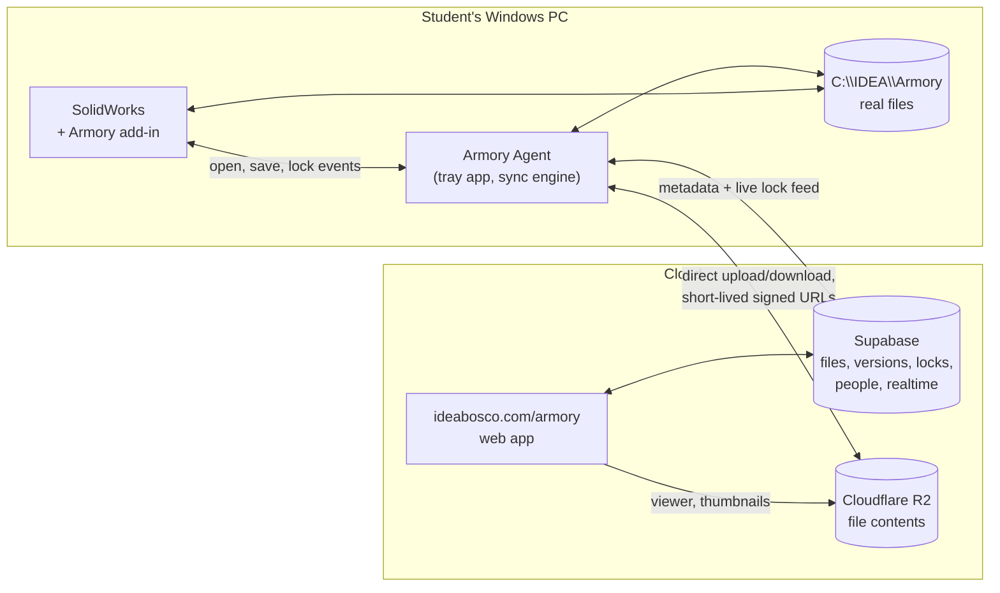

# IDEA Armory

Working name for the IDEA file vault: team CAD and project files, synced, locked and
versioned, for FRC Team 5669 and for IDEA class team projects. This document owns the
product scope. It separates what Mr. Pina said from what this scope proposes, and every
open choice is in "Decisions owed" at the end with the default that will be taken.

Scoped 2026-09-27 from the IDEA & FRC chat. **Status, 2026-10-08: built and in use.** The
website (`/armory`, on the home launcher), the schema (migrations 0231 to 0233) and the
Windows app are live; the app's 0.3.0 release builds its half of the v0.3 server contract
below. "Where it runs now" lists what is on the website.

## What Mr. Pina asked for, in his words

Stated 2026-09-27:

- Something "along the lines of" CacheCAD, "a file management interface for Google Drive
  that allows selective syncing of files", for designing things, for the FRC team, and
  for IDEA team projects.
- CacheCAD "works", but is "quite buggy", "the interface could be a lot better and the
  user experience can be a lot better, especially for high schoolers", who "have never
  used anything like this before and aren't familiar with how Google Drive works". For
  the team, "it's not practical enough to be useful. It was useful last season, but our
  file management was such a mess still."
- "A fully custom from the ground up IDEA application", named "something creative with
  idea in it" (IdeaCAD is taken).
- On the web, downloadable, or both: "whatever the best combination of things is, I want
  it." SolidWorks needs files on the desktop.
- "No compromises, absolutely none." "Very much functional, very much form. A beautiful
  application, but also an extremely functional and useful application."
- SolidWorks PDM is not available: the team has the Student Sponsorship package, and the
  app must also serve IDEA class projects on IDEA computers that "don't have access to
  the same things".

## What the research found

**CacheCAD** (cachecad.com, built with FRC 8096). A Windows desktop app that diffs a local
folder against a Google Drive folder and shows two checklists, Upload Changes and
Download Changes. A file whose newer side it cannot determine is marked Mismatch and left
unchecked. There is no locking, so nothing stops two students editing one part. History
is Google Drive's revision history, 30 days by default. The author's own guide says
projects load slowly "because of the way the Google API interface works". Early bugs
reported on its launch thread: a `/` or an emoji in a Drive folder name crashed the
client. Stable release 1.1.1 is dated 2024-01-05; a 1.2.0 beta is dated 2025-09-24.

**The failure every tool shares is the human step.** Team wikis that run CacheCAD tell
students "ALWAYS DOWNLOAD YOUR CHANGES BEFORE WORKING", and warn that work is deleted when
they do not. On the 3DEXPERIENCE thread one mentor joked about a daily 4:50 PM "CHECK IN YOUR FILES"
reminder; another said their team kept a sign on the door under GrabCAD, and under
CacheCAD he walked to every computer and synced it himself because nobody remembered.
PDM, GrabCAD, CacheCAD and 3DEXPERIENCE all depend on a student remembering to press a
button. **Armory's central rule is that no correctness depends on anyone remembering
anything.**

**The landscape.**

| Option | Status for us |
|---|---|
| GrabCAD Workbench | Discontinued June 1, 2023. It is what every FRC SolidWorks team is still trying to replace |
| SOLIDWORKS PDM | The 2026 education matrix shows PDM Standard in the Education Edition only, and no PDM in Student Sponsorship. It needs a self-managed server. One team nearly set it up and stopped because upkeep would fall apart once the one student who understood it graduated |
| 3DEXPERIENCE (in the sponsorship) | Works with desktop SolidWorks through an add-in; called clunky by the teams that tried it |
| Onshape | Solves sharing by being a different CAD program. Not an option while SolidWorks is what IDEA teaches |
| Git with Git LFS | Real locks (`git lfs lock`), and LFS makes a file locked by someone else read-only, which SolidWorks respects. Costs: every checkout downloads whole files, no reference awareness, and Git itself is the wrong mental model for a freshman |
| FrameCAD (FRC 2129) | The closest prior art: check-out and check-in locks, a SolidWorks task pane add-in, auto part numbering, where-used, release states. Its repository description still says Git LFS; its current README runs on a Google Shared Drive plus a self-hosted lock server. One team's project, zero stars. Its feature list is a checklist of what teams want; its manual Publish and Sync buttons keep the human step |

**SolidWorks mechanics that decide the design.**

- SolidWorks resolves a referenced file by searching memory first, then the folders
  listed in File Locations, then folders around the parent document and the path saved
  in it.
  **A same-named file already open wins**, which is why two different parts both called
  `Plate.SLDPRT` break an assembly. File names must be unique across the whole vault.
- Renaming a file outside SolidWorks breaks every assembly and drawing that references
  it. Renames and moves must go through a tool that updates the parents.
- The SOLIDWORKS Document Manager API reads and rewrites references without SolidWorks
  running, but its key is issued only to customers under subscription, and a key reads
  only files from its own version or older. Whether our sponsorship qualifies is unknown
  until a key is requested (decision 5). Without one, reference work happens inside the
  add-in while SolidWorks is open, through the full SolidWorks API, which needs no key.
- Every machine should see the vault at the **same absolute path**, so a path saved in a
  parent on one computer is correct on every other.

**Google Drive as the store.** Drive can lock a file (`contentRestrictions.readOnly`), but
any user with edit access can remove the lock, so it is advisory. Its API latency is the
slowness CacheCAD's own author describes. And the students this is for do not understand
Drive's sharing model, which is Mr. Pina's complaint.

## The answer: three pieces, one system

Both the website and a download, because each does something the other cannot. A browser
cannot keep files at a fixed disk path in the background, and SolidWorks needs real files
there. A desktop app alone cannot be opened from a phone, a Chromebook, or a Mac.

1. **Armory on ideabosco.com.** Browse every project, see who is editing what right now,
   every version of every file with who saved it and when, a 3D view and thumbnails, the
   release state of every part, the manufacturing queue, and team and class admin. Works
   on any device. Signs in with the site's existing Google sign-in.
2. **Armory Agent, a Windows tray app** downloaded from the site. Owns the vault folder at
   `C:\IDEA\Armory`, keeps it current in the background, uploads saves, holds and
   releases locks, and queues everything while offline. Built on .NET with a WebView2
   window whose screens are the same Svelte components as the website, so the two look
   and behave as one product. Windows only, because SolidWorks is; Mac and Chromebook
   users use the website.
3. **The Armory add-in inside SolidWorks.** A task pane plus banners: takes the lock when
   you start editing, uploads when you save, tells you when a newer version is waiting,
   creates new parts with their part number already assigned, and does renames, moves and
   copies with every reference updated.

**Storage.** File contents go to Cloudflare R2, stored by content hash so an unchanged
file is never stored twice. R2 charges nothing for downloads, which is the whole cost of a
sync tool, and $0.015 per GB-month above a free 10 GB (100 GB is about $1.35 a month).
Everything else (files, versions, locks, people, projects) lives in the idea-app Supabase,
whose realtime feed is what makes a lock appear on every screen at once. The website never
proxies file bytes: it hands out short-lived signed URLs and the agent talks to R2
directly. A nightly readable mirror to a Google Shared Drive is the escape hatch, so the
data never depends on Armory existing (decision 2).

## How it behaves: the product rules

These are the rules the build is measured against. Each one removes a step CacheCAD
leaves to a person.

1. **There is no upload button.** Saving in SolidWorks is the upload. The agent sends the
   new version in the background, and the file shows as saved on every screen within
   seconds.
2. **There is no download button.** The agent pulls every newer version as it lands. A
   file you have open is never overwritten under you; SolidWorks shows "A newer version
   from Maria is ready" and reloads when you say so.
3. **Locks take themselves.** The first edit to a file takes its lock, silently. Anyone
   else who opens it gets it read-only with a banner naming who has it and a Request
   button that notifies them. Closing the file, saved, releases the lock.
4. **A lock is visible everywhere, live**, on the website, in the agent and in the
   add-in: who, since when, and whether their changes have reached the server.
5. **Nothing is ever overwritten or lost.** Every version is kept, with no 30-day window.
   A lock broken by a mentor, or an offline edit that collides with a newer one, is saved
   as a side version with the student's name on it, never discarded; a lead picks which
   one continues. **The one exception is a deliberate Delete forever** (v0.3, migration
   0233): a site admin deletes an ARCHIVED project after typing its name, and a site admin
   or the project's mentor deletes the already-removed files under a folder. Nothing else
   can delete history, and a purge refuses rather than break another file's history.
6. **Offline works.** At a competition with no internet, students keep working on real
   files. The agent queues every save and lock and reconciles when it reconnects.
7. **Names are unique and permanent.** A new part gets its part number at creation from
   the team's scheme (decision 4), so a rename is never needed to "make it official". The
   vault refuses a duplicate name.
8. **Renames, moves and copies go through Armory**, and every parent assembly and drawing
   is updated. A Save As that would fork a part is caught and offered as a proper copy.
9. **The same path everywhere.** `C:\IDEA\Armory\<project>` on every computer, so saved
   reference paths are right on every machine.
10. **Get what you need, not everything.** Selective sync by project and subsystem, and
    "get this assembly" pulls the assembly and everything it references, whatever folder
    it is in.
11. **The COTS library is separate and read-only**: vendor parts shared across every
    project, updated by leads, never edited in place by a student.
12. **Any file syncs.** SolidWorks gets the extra intelligence, but a Fusion file, an STL,
    an IdeaCAD export, a photo or a spreadsheet is versioned and locked the same way, so
    IDEA classes without the FRC setup use the same vault.
13. **No training.** A student who has never used a vault is syncing, editing and saving
    correctly in their first session, untold. This is the acceptance test, in the same
    sense as IdeaCAD's.
14. **Nobody is locked out by their SolidWorks release.** Every file in the vault opens
    and edits in the oldest release the team uses. See "Two SolidWorks versions at once".

## Two SolidWorks versions at once

Stated by Mr. Pina 2026-09-27: FRC members' own computers run SolidWorks 2026 and the IDEA
desktop PCs run SolidWorks 2025. Most work happens in class on the 2025 machines, and "no
one is being left out": a 2025 user must be able to open and edit anything a 2026 user
saved. Buying 2026 for the IDEA PCs only moves the same problem to next year, so the
system has to handle mixed versions permanently.

**What SolidWorks itself does.**

- A file saved in a newer release does not open for editing in an older one. The last
  service pack of a release (SP5) opens parts and assemblies from the next release
  read-only, as a single "Future version file" with no feature tree: usable in an
  assembly and for measuring, not editable. It does not open drawings from the next
  release at all.
- Since SOLIDWORKS 2024, **Save as Previous Version** writes a part, assembly or drawing
  back up to two releases, with its feature tree, so it stays editable in the older
  release. It is lossy. A feature that did not exist in the older release blocks the save
  until it is removed, and the save silently drops annotations, appearances, decals,
  scenes and lights, custom properties, explode steps, simulation studies and add-in
  data. One reseller wrote in 2024 that it requires an active subscription license;
  whether our Student Sponsorship and the IDEA PCs' license count is unknown until tried.

**Armory's rule: no file in the vault is ever newer than the oldest SolidWorks the team
uses.** The vault carries a pinned version (2025 now), and every path into it keeps that
true:

1. **On a 2026 computer, a save is written back to 2025 automatically.** The add-in runs
   Save as Previous Version on every save of a vault file, so what reaches the vault
   opens and edits in 2025. The student does nothing different.
2. **Nothing it drops is lost, because Armory keeps it.** Custom properties (part number,
   description, material, vendor) live in Armory's database, and the add-in writes them
   back into the file on every open and save, in either version. Appearances and
   annotations are what a 2025 save loses; that is a cost of mixed versions, stated once
   in the add-in, not a hidden one.
3. **A save that cannot go back is stopped before it happens**, never uploaded. If a
   2026 student uses a 2026-only feature, the add-in names the feature when it is added
   and again at save, and offers two ways out: rebuild it with a 2025 feature, or keep it
   as that student's private draft until the team moves to 2026. The shared file stays
   editable by everyone.
4. **A 2026-format file can never slip in.** The agent checks the saved release of every
   SolidWorks file it uploads and refuses one newer than the vault's, whether it came
   from SolidWorks with the add-in off, a Save As outside the vault, or a download.
5. **Viewing never depends on the version.** The website's viewer and thumbnails show
   every file to everyone, on any device, whatever release saved it.
6. **One add-in for every release, not two.** Built against the oldest SolidWorks API the
   team runs and tested on both releases before every add-in release. Where a call exists only in the newer release (Save as Previous Version is
   one), the add-in checks the running release and uses it only there.
7. **The season rollover raises the vault's version in one move.** Each summer, once
   every machine the team uses has the new release, a lead raises the pinned version and
   files upgrade as they are next saved. Save as Previous Version reaches two releases
   back, so the IDEA PCs can trail personal computers by up to two releases before
   anything breaks; Armory shows that gap and warns a season ahead.

**If back-saving turns out not to be available under our licenses**, the rule still holds
by the other route: personal computers install the vault's release (2025 now) alongside
or instead of 2026, and the add-in on a 2026 install opens vault files read-only with a
banner saying so. That is decided by the phase 0 spike, not guessed.

## Beyond sync: what makes it the team's system

- **Release states** per part: Draft, In Review, Released, Made. A Released part is
  locked against edits until a lead reopens it. The manufacturing queue lists Released
  parts by process and material, for the shop to work through.
- **Where used and BOM.** Every assembly a part is in; a live bill of materials per
  assembly and for the whole robot, with mass rollups from each part's mass properties.
- **History you can read.** Every version with its thumbnail, its author and a note, a
  timeline per file and per project, and one-click restore of any version as the new
  latest.
- **IDEA Classroom tie-in.** A class team project is an Armory project. The instructor
  sees each student's own saves on the team's files, which is contribution evidence for
  grading a team project without asking who did what. An assignment links to its project.
- **Roles.** Student, CAD lead, mentor, instructor. Leads and mentors break locks
  (Force check in), and so does a site admin on any project (v0.3, decision 3 below),
  release parts and manage the COTS library. A site admin also manages any project's
  people with a mentor's reach, and only a site admin or a teacher who mentors the
  project may search the school's accounts by name (v0.3, 0233).

## Design

A product identity of its own, like GAUNTLET, VANGUARD and GREENLINE, built to
`IDEA_INTERFACE_STANDARDS.md` on both the website and the agent. The screens a student
lives in are three: my files (what I have locked and what is unsaved), the project tree
(with live lock and status marks on every row), and a file's history. Everything else is
for leads. Scoped through the Claude Design protocol before any screen is built.

## Phases

The date that matters: **Q3 starts January 5, 2027, and every IDEA class does FRC from
then** (`IDEA_context.md` 2.1). Armory has to be proven by then, with the team trained by
using it rather than by being taught it.

0. **Spike, before any product code.** Measure on one real IDEA computer and last season's
   robot CAD: upload and download throughput from the school network to R2, SolidWorks
   add-in open, save and close events, reading references through the add-in, whether a
   Document Manager key is granted, and the installed size of the agent. **Versions:**
   whether Save as Previous Version works under the Student Sponsorship license and the
   IDEA PCs' license, and through the API; whether the IDEA PCs' 2025 is on SP5; whether
   the sponsorship license installs 2025; how the agent reads a file's saved release
   without SolidWorks running; and a round trip of a real robot subassembly from 2026 to
   2025 and back, listing exactly what changed. Each result written down with its date
   and what measured it.
1. **Vault and agent.** Server model, R2 storage, sync engine, locks, offline queue, the
   agent's tray window, and the website's project browser with live locks and history.
   Usable by the team for real work without the add-in.
2. **The add-in.** Auto-lock, save-is-upload, newer-version banners, part numbering at
   creation, safe rename, move and copy, dependency-aware get.
3. **The team system.** Release states, manufacturing queue, where used, BOM and mass,
   3D view on the website, COTS library.
4. **Classes.** IDEA Classroom tie-in and per-student contribution views.

## Where the code lives

- `pina-hash/idea-armory` (private): the Windows agent, the add-in and the sync core,
  in .NET. Lane C1, issued 2026-09-27 to GPT-6 Astra in Codex, builds `Armory.Core`, the
  pure rules library, and a deterministic simulation that proves no saved work is lost.
  It depends on no open decision and no spike result; its defaults (name, part number
  pattern, lock authority) are all configurable.
- `pina-hash/idea-app`: the website at `/armory`, the Supabase schema and the RPCs, in a
  later lane.

## Where it runs now

Added 2026-10-06 by lane B (`docs/prompt-ledger/entries/armory-b-website.md`), built to
`docs/agent/CONTRACT.md` in pina-hash/idea-armory at `b18791d`. Armory is **unlisted**:
nothing on the home page or in the site's shared navigation points here until the pilot.

**Routes** (signed-in pages render a sign-in panel rather than redirecting, so a connect
link survives a sign-in):

| Route | What it is |
|---|---|
| `/armory` | My projects; a site admin also gets Create project |
| `/armory/<project>` | The folder tree with a live mark on every file, and the people (mentors and CAD leads add and remove) |
| `/armory/<project>/file/<file>` | Every version and side version, with who saved it and when, and who holds it now |
| `/armory/connect` | Contract 3b: "Connect <device> to Armory as <email>?" |
| `/armory/download`, `/armory/download/<file>` | The Windows app, streamed from the private release |
| `POST /api/armory/blob-url` | Contract section 2 (the agent's Bearer token) |
| `POST /api/armory/connect/start`, `POST /api/armory/connect/exchange` | Contract section 3 |
| `/dev/armory` | The dev harness (404 in production) |

**What Mr. Pina sets in Vercel** (Production and Preview, server-only, never `PUBLIC_`):

- `ARMORY_R2_ACCOUNT_ID`, `ARMORY_R2_ACCESS_KEY_ID`, `ARMORY_R2_SECRET_ACCESS_KEY`,
  `ARMORY_R2_BUCKET`. Until all four are set, `blob-url` answers 503
  `armory_storage_not_configured` and the project page says file storage is not switched
  on. The R2 token needs Object Read and Write on that one bucket only.
- `ARMORY_RELEASES_TOKEN`: a fine-grained GitHub token with **Contents: read** on
  pina-hash/idea-armory only. Unset, `/armory/download` says "Ask Mr. Pina for the Armory
  flash drive" and shows no link.
- `SUPABASE_SERVICE_ROLE_KEY` is already set; Armory uses it for the connect codes and to
  mint the agent's own session.

**Supabase auth redirect allowlist: nothing to add.** The agent's session is minted
server-side (contract 3e): `auth.admin.generateLink` is called without `redirectTo`, only
its `hashed_token` is used, and `verifyOtp` exchanges that hash directly, so no email is
sent and no redirect URL is ever followed. The loopback `http://127.0.0.1:<port>/callback`
is a redirect THIS site issues after its own POST; Supabase never sees it.

**The schema is migration 0231:** `supabase/migrations/0231_armory.sql`, approved by
Mr. Pina on 2026-10-06 (`docs/decisions/entries/46-armory-migration-number-and-approval.md`)
and applied to production by `migrate.yml` on the push that landed it. Until that apply
has run, every Armory page says "Armory is not switched on yet" and the API answers 503.

## The v0.3 server contract (migration 0233)

Added 2026-10-07 for Mr. Pina's "IDEA Armory website requests v0.3". The schema is two
parts of `supabase/migrations/0233_feedback_round_and_armory_v3.sql` (parts
`armory-reports` and `armory-core`); `migrate.yml` applies it on the push that lands it.
Every function a 0.2.x app already calls keeps its signature and answers exactly as it
did for every member, refusal text and SQLSTATE included (tests/db/armory-v3.test.ts
holds a corpus of calls to that, membership calls among them), with one deliberate
change: `armory_break_lock` with a null device used to refuse "device is not registered
to caller" and now reaches the role check. What widens is a site admin's reach (Force
check in, archive, people), never a member's.

**Refusals keep the Armory convention**: a raised error with a SQLSTATE and, where there
is more to say, a JSON `DETAIL` (`reason`, plus `names` and `total`, or `field`,
`limit` and `size`). PostgREST answers `22023` and `P0001` with HTTP 400, `23505` (a
name already taken) and `23503` with **409**, `42501` with 403 (401 with no session), a
`PTxyz` code with HTTP `xyz`, and class 55 and `P0002` with 500. Never `54000`:
PostgREST answers it with 500, which a retrying client reads as transient. (The HTTP
mapping is PostgREST's documented behaviour; it was not measured here.) Branch on the
SQLSTATE and `DETAIL.reason`, never on the status alone.

### Item 1: live updates (already live)

`armory_change_feed` has been in the `supabase_realtime` publication, granted to
signed-in users and behind its member policy since 0231. 0233 re-runs the guarded add and
prints `armory_change_feed in supabase_realtime: yes, already | yes, added now | no
publication on this database` into the applied record. The website already subscribes
(`src/lib/armory/live.ts`) with a 15-second fallback poll. The Windows app half shipped in
Armory 0.3.0. **Since 0233 a site admin reads every project's feed rows**, so an app
signed in as an admin must filter its subscription by `project_id=eq.<id>` (the website
does), or it receives every project's changes.

### Item 2: Force check in

| RPC | Change |
|---|---|
| `armory_break_lock(p_file uuid, p_device uuid, p_operation uuid) returns boolean` | Unchanged signature. A site admin may call it on any project; `p_device` may be NULL (the website has no computer); a device that is named must still be the caller's. The refusal is unchanged: `only a mentor or cad_lead may break a lock` (P0001). The app sends `p_device` exactly as before. |
| `armory_my_projects() returns jsonb` | Each row gains `can_take_back` (mentor, CAD lead, or site admin). The `role` is never rewritten, and the list stays MEMBERSHIP-ONLY: it is what a computer syncs, so an admin's computer never starts syncing every project. |
| `armory_set_project_archived(p_project, p_archived, p_operation)` | A site admin may archive or restore any project (a purge needs it archived). A nonexistent project answers `project not found` (P0002). |
| `armory_add_member(p_project uuid, p_email text, p_role armory_member_role, p_operation uuid) returns boolean` | Unchanged signature. A site admin may add a member to, or change a role in, any project with a mentor's reach (so they may grant mentor and CAD lead), because the website offers them the people search on every project. The last-mentor rule holds for them too (`A project always keeps at least one mentor.`, P0001); a nonexistent project answers `project not found` (P0002) to an admin only. Everyone else meets 0231's refusals unchanged: `only a mentor or CAD lead may add members`, `only a mentor may grant mentor or cad_lead`, `only a mentor may change a mentor or cad_lead` (all 42501). Adding a member does not make the admin one. |
| `armory_remove_member(p_project uuid, p_email text, p_operation uuid) returns boolean` | Unchanged signature. A site admin may remove from any project, last-mentor rule included; P0002 for a nonexistent project, to an admin only. Everyone else: `only a mentor may remove members` (42501), unchanged. |

### Item 3: Delete forever

| RPC | Who | Returns and refusals |
|---|---|---|
| `armory_purge_preview(p_project uuid, p_folder text default null) returns jsonb` | Null folder: site admin. A folder: site admin or the project's mentor. Else 42501. | `{name, folder, archived, files, live_files, live_names, versions, side_versions, checkouts, blocking_checkouts, blocking_names, referenced_elsewhere, blobs, bytes, can_purge}`. `checkouts` is how many the purge would release; `blobs` and `bytes` are the stored files actually freed. No project: P0002. |
| `armory_purge_project(p_project uuid, p_confirm_name text, p_operation uuid) returns jsonb` | Site admin (42501 otherwise). | In order: P0002 no such project; 55000 `{reason: not_archived}`; 22023 `{reason: name_mismatch}` unless the typed name equals the stored name exactly (NFC, case and spaces included); 55006 `{reason: referenced_elsewhere, names, total}` when another project's history names one of its versions. Returns `{name, files, versions, side_versions, checkouts_released, blobs_queued, bytes_queued}`. Live checkouts are released. |
| `armory_purge_folder(p_project uuid, p_folder text, p_operation uuid) returns jsonb` | Site admin or the project's mentor (42501). | Only REMOVED files at or under the folder (case-sensitive, 0232's folder rule). 22023 bad folder; 55006 `{reason: live}` while any file there is live; 55006 `{reason: checked_out}` for a checkout taken AFTER a file was removed (the remover's own leftover checkout is released and counted); 55006 `{reason: referenced_elsewhere}`. Returns `{folder, files, versions, side_versions, checkouts_released, blobs_queued, bytes_queued}`; an empty folder answers zeros and writes no change. Writes one change, kind `folder_purged`, payload `{folder, files, file_ids, by}`. Earlier feed rows of the files stay. |
| `armory_project_purged(p_project uuid) returns timestamptz` | Any signed-in user. | When the project was deleted forever, or null. |
| `armory_orphans_count() returns integer`, `armory_orphans_pending(p_limit integer default 200) returns text[]`, `armory_orphans_swept(p_hashes text[]) returns integer` | Site admin (42501). | The storage sweep queue, below. |

**On the team's computers, Delete forever moves files; it never erases them.** Armory
0.3.0 learns of a deleted project (from `armory_project_purged`) or a purged folder (from
the `folder_purged` change) the next time that computer connects, and moves those files
into the app's hidden recovery folder. A file that is open is moved once it is closed, and
a computer that is off does it when it next connects. So the server's rows go at once, and
each computer catches up on its own time. The website's confirm and its "deleted forever"
note say this (`PURGE_COMPUTERS_WORDS` and `PURGED_COMPUTERS_WORDS` in
`src/lib/armory/team.ts`); the folder's confirm lives in the app, and the website shows a
purged folder only as a line of activity.

**A project purge writes no change-feed row and cannot.** The feed's project key and its
member policy die with the project, so realtime would deliver nothing. It leaves a receipt
instead (`armory_purged_projects`: the id, the name, when, which admin, the counts; no
member address is kept).

**Nothing else deletes history, TRUNCATE included.** The immutability trigger is a row
trigger, and TRUNCATE never fires one, so on `armory_versions`, `armory_side_versions`
and `armory_version_releases` it would empty history with no marker and no owner test.
`service_role` held it through the hosted default privileges (measured: it emptied the
release rows with no refusal); 0233 revokes it there, and no client role ever held it.
Only the tables' owner keeps it.

**Stored contents are shared.** A file's bytes live at `blobs/sha256/<2>/<2>/<hash>`, so
one object can back files in several projects. A purge queues, in `armory_orphaned_blobs`,
only the hashes no surviving version or side version names. The website removes them:
`armory_orphans_pending` (which first marks any hash a version names again as kept, and
never lists it), then for each hash a presigned DELETE and a HEAD, and
`armory_orphans_swept` only with the hashes whose HEAD answered 404. A hash named again
between the listing and the sweep is kept and logged as a warning; the window that remains
is one app's blob-url-to-commit time overlapping a running sweep, and it is stated rather
than closed.

### Item 4: the app's own feedback and incidents

Rows are read only by a site admin, on `/admin/feedback` (two tabs). The submit functions
take no identity: the address is the signed-in account's.

| RPC | Limits and refusals |
|---|---|
| `armory_submit_app_feedback(p_kind text, p_body text, p_app_version text, p_device_name text, p_context jsonb) returns uuid` | `kind` is bug, idea or other (any case). `body` 1 to 8000 characters after trimming. `app_version` 1 to 64. `device_name` trimmed and cut to 120 (never refused). `context` a JSON object of at most **128 KiB** (131072 bytes by `pg_column_size`, the size as sent; null is `{}`). The same limit is a CHECK on the table, and the admin list returns `context` whole, which is why it is small. Bad input: 22023 `{reason: kind / empty / too_long / not_object / too_large, field}`; `too_large` and `too_long` carry `limit` and `size`. **20 an hour per account**, then `PT429` `{reason: rate_limited, limit: 20, window_seconds: 3600, retry_after_seconds}`. |
| `armory_submit_app_incident(p_kind text, p_summary text, p_app_version text, p_device_name text, p_project uuid, p_report jsonb, p_feedback uuid) returns uuid` | `kind` matches `^[A-Za-z][A-Za-z0-9_-]{0,39}$` (a word, so a kind a later app adds still lands; known: crash, slowAction, slowPass, repeatedFailure, repairedCheckout, readOnlyBroken, userReport). `summary` 1 to 500. `report` a JSON object of at most **1 MiB** (1048576 bytes, measured as sent); null is `{}`. `p_project` is kept only when that project exists (a purged project's id is stored as no project, never refused). `p_feedback` must be one of the caller's own notes: otherwise 22023 `{reason: feedback_not_found}`, the same for not found and not yours. **30 an hour per account**, then `PT429` with `limit: 30`. **Every submit deletes every incident older than 90 days.** |

Admin only (42501 otherwise): `armory_app_feedback_admin_list(p_limit integer)` (which
carries each note's `context` whole) and
`armory_app_incidents_admin_list(p_limit integer)` (newest first, at most 1000; the
incident list leaves out `report`, hides anything older than 90 days, and adds
`report_bytes`, `project_name`, `feedback_body` and `submitter_name`, the chosen display
name else the full name, or null), and `armory_app_feedback_set_status(p_id, p_status)` /
`armory_app_incident_set_status(p_id, p_status)` with new, seen, resolved or spam. An
admin reads a whole report with `select id, report from armory_app_incidents where id in
(...)`.

**An exported incident file** (one per incident, written by the console) is JSON:
`{format: "idea-armory-incident/1", id, created_at, kind, summary, app_version,
device_name, email, submitter_name, project_id, project_name, feedback_id, feedback_body,
status, report}`, where `report` is exactly what the app sent. Named
`armory-incident-<Los Angeles date>-<kind>-<first 8 of id>.json`. With submitter names
withheld, `email` and `submitter_name` are left out.

### Item 5: team status

| RPC | What it does |
|---|---|
| `armory_heartbeat(p_device uuid, p_app_version text, p_state text) returns void` | The caller's own computer only (`device is not registered to caller`, P0001). Stamps `armory_devices.last_seen`, `app_version` (at most 40) and `state` (one word; known: idle, syncing, offline-soon). A null or empty `p_app_version` or `p_state` keeps the stored value, so a bare liveness ping never erases them; a value replaces it at once. A call within 20 seconds that changes nothing writes nothing. Writes no change. 22023 for an overlong version or a state that is not one word. |
| `armory_team_status(p_project uuid) returns jsonb` | Members and site admins (42501 otherwise). One entry per member: `{email, role, name, avatar, avatar_url, pathway, has_account, devices_total, devices: [{id, name, registered_at, last_seen, app_version, state}], checkouts: [{file_id, folder, name, path, since, device_id}]}`. A member with no account carries `has_account: false` and no name or picture. Devices are those heard from or registered in the last 30 days, or holding a live checkout in this project; `devices_total` counts all of them. |

The website says "Armory open" or "Last heard from <time>", never "offline": a quiet
computer may simply be asleep. Armory 0.3.0 beats every 45 seconds, and at once when its
state changes. The Team view counts a computer as open while its last beat is at most
three minutes old (`ARMORY_ONLINE_MS` in `src/lib/armory/team.ts`, 120 seconds until
2026-10-08): the view re-reads the team about once a minute, so a healthy computer can
already look 117 seconds old just before a read, and three minutes holds through one
missed beat and one late read. A computer whose state is `offline-soon` reads "Last heard
from" at once. Each computer shows its app version, and one older than 0.3.0 (or with no
version) carries a "Needs the new Armory" link to `/armory/download`, because an app before
0.3.0 sends no heartbeats and can never read "Armory open".

**The two version limits do not match.** `armory_heartbeat` refuses an `app_version`
longer than 40 characters (22023), while `armory_submit_app_feedback` and
`armory_submit_app_incident` take up to 64. A version string of 41 to 64 characters (a long
pre-release or build tag) would send feedback and incidents but have every heartbeat
refused. Proposed for the next Armory migration, not written: raise the heartbeat's limit
and the `armory_devices.app_version` column check (also 40, added by 0233) to 64, so all
three agree. Raising is the safe direction: nothing stored today is refused by it.

### Item 6: the project row first, and batches

Every write that touches a file now takes its project row (FOR KEY SHARE) before any other
row, so it waits behind a folder rename, a folder delete or a purge (which hold the project
FOR UPDATE) instead of crossing it. Measured on the deployed bodies: a folder rename
crossing a check out ended one of them with 40P01, and a take back crossing a purge did the
same; with 0233 both queue.

| RPC | Returns |
|---|---|
| `armory_lock_files(p_files uuid[], p_device uuid, p_operation uuid) returns jsonb` | `armory_acquire_lock` per file, in id order. `{total, succeeded, refused, results: [{file_id, ok, acquired}] or [{file_id, ok: false, code, message}]}`. 1 to 500 distinct files, else 22023 `{reason: count, total, limit: 500}`. A replayed operation answers the first time. |
| `armory_release_locks(p_files uuid[], p_device uuid, p_operation uuid) returns jsonb` | The same over `armory_release_lock`, with `released`. |

### The website's reads

`armory_can_view(project)` (a member, or a site admin) now gates the ten member-read
policies and `armory_project_files` (which gains a per-file `side_versions` count),
`armory_file_history`, `armory_list_changes` and `armory_project_checkouts`; each keeps its
own refusal text and SQLSTATE. `armory_project_summaries(p_project uuid default null)`
lists the caller's projects, and every project for a site admin with `role` null where they
are not a member: `{id, name, season, role, pinned_release, release_gate, archived,
archived_at, created_at, files, removed, checked_out, mine, members, versions,
side_versions, bytes, stored, last_change_at}`. `armory_people_search(p_project, p_query,
p_limit default 12)` is for a site admin, or a mentor of the project whose own address is
a school teacher account (`@boscotech.edu`); anyone else, a student holding the mentor
role and a mentor on another domain included, gets 42501 `only a teacher mentor or a site
admin may search for people` and adds people by email. The search is a name-to-address
directory of every school account, and a mentor can grant mentor to a student, which is
why the role alone does not open it. School accounts only, matched by the SHOWN name and
the address's local part, at most 25, `{email, name, avatar, avatar_url, pathway,
member_role}`.

### What the Windows app must do (done in Armory 0.3.0)

Every item below shipped in the Windows app's 0.3.0 release (pina-hash/idea-armory,
`docs/agent/release-notes/v0.3.0.md`). Kept as the record of what the contract asked for.

- Treat `P0001 'not a project member'` (from `armory_list_changes`, `armory_acquire_lock`,
  `armory_save_side_version`) and `42501 'not a project member'` (from
  `armory_project_files`, `armory_file_history`, `armory_create_file`,
  `armory_move_file`) alike, as "no longer a member of this project".
- When a project disappears from `armory_my_projects` or starts answering that refusal, ask
  `armory_project_purged(project)`. A time means it was deleted forever: drop the local copy
  and its records quietly. Null means the person was removed from it: handle that as today.
- Expect the change kind `folder_purged` (`{folder, files, file_ids, by}`): those files and
  their history are gone; drop them locally.
- Send `p_device` on `armory_break_lock` exactly as before. Show the take-back control when
  `can_take_back` is true.
- Send `armory_heartbeat` while running (about every 30 to 60 seconds, and on a state
  change). A ping with a null version or state keeps what was last sent.
- On `PT429`, wait `retry_after_seconds` before sending again. On 22023 `too_large` or
  `too_long`, shorten and send once; never retry the same payload. A feedback note's
  `context` is at most 128 KiB; an incident's `report` stays at 1 MiB.
- Filter any realtime subscription and direct table read by project: an admin's session
  now reads every project.

## The v0.3.1 server contract (migration 0234)

Added 2026-10-08 for Armory 0.3.1 (pina-hash/idea-armory
`docs/agent/website-requests-v0.3.1.md`, ledger 0374). Force check in was the one bulk
action with no batch RPC: Armory 0.3.1 calls `armory_break_lock` once per file, 16 at a
time. `supabase/migrations/0234_armory_break_locks.sql` adds the batch. It is one new
function and changes nothing else, so every existing call answers exactly as before.

| RPC | What it does |
|---|---|
| `armory_break_locks(p_files uuid[], p_device uuid, p_operation uuid) returns jsonb` | Force check in for 1 to 500 files in one call. Each file goes through `armory_break_lock` itself, in id order, under an operation id derived from `p_operation` and the file, so every per-file rule is that function's: a mentor, a CAD lead or a site admin may (`can_take_back`); a broken lock writes the same `lock_broken` change, `{by, former_holder, former_device_id}`; a refusal has the same text and SQLSTATE. One file's refusal never stops the rest. Answers `{total, succeeded, refused, results}`, where each result is `{file_id, ok: true, broken}` or `{file_id, ok: false, code, message}`. `broken: false` means nobody had it checked out any more. `succeeded + refused = total`. |

**Inputs.** Nulls and repeats in `p_files` are dropped before counting. `p_device` may be
null (the website has no computer); a device that is named must be the caller's, checked
once for the whole call, as `armory_release_locks` does. `p_operation` is required.

**Refusals of the whole call**, before any file is touched:

| SQLSTATE | Message | DETAIL | When |
|---|---|---|---|
| `22023` | `A batch is 1 to 500 files.` | `{"reason": "count", "total": N, "limit": 500}` | No files after dropping nulls and repeats, or more than 500. |
| `P0001` | `device is not registered to caller` | none | `p_device` is not null and is not one of the caller's computers. |
| `P0001` | `operation id is required` | none | `p_operation` is null. |
| `P0001` | `operation id was already used by another caller or RPC` | none | `p_operation` was used by someone else, or for a different RPC (including `armory_break_lock`). |
| `42501` | permission denied | none | No session (`anon`): the function is granted to `authenticated` only. |

**Refusals of one file**, inside `results` as `{ok: false, code, message}`, are
`armory_break_lock`'s: `P0001 only a mentor or cad_lead may break a lock` for a caller who
is not a mentor, CAD lead or site admin on that file's project. A file id that does not
exist answers the same refusal for a member, and `ok: true, broken: false` for a site
admin, because that is what `armory_break_lock` answers for it.

**Replay.** Calling again with the same `p_operation` answers exactly what the first call
answered and writes nothing (`armory_replay` / `armory_remember`), even if a file was
checked out again in between.

**Lock order.** Each file's call takes its project row (FOR KEY SHARE) before its lock
row, and files go in id order, the same order as `armory_lock_files` and
`armory_release_locks`. So two batches over the same files, or a batch and a folder
rename or purge (which hold the project row FOR UPDATE), queue instead of deadlocking.
An app still retries a `40P01` or `40001` a bounded number of times, as for the other
batches.

**Realtime.** A batch writes one `armory_change_feed` row per file it checks in. The
website's project page already folds a burst into one reload (`changeCoalescer` in
`src/lib/armory/live.ts`: one reload a second after the last event, and never more than
five seconds after the first).

**Adopting it.** Call it when present, and fall back to one `armory_break_lock` per file
on `PGRST202` (the migration not applied yet). Tests:
`tests/db/armory-break-locks.test.ts`.

## The v0.3.2 server contract (migration 0235)

Added 2026-10-08 for Armory 0.3.2 (pina-hash/idea-armory
`docs/agent/website-requests-v0.3.2.md`, ledger 0375). Its items 1 to 3 are the v0.3.1
contract above (0234). Item 4 changes one page and no protocol; item 5 is
`supabase/migrations/0235_armory_app_feedback_v2.sql`.

### Item 4: who is being connected

`/armory/connect` now asks "Connect <device> as <name>?" (the chosen display name, else
the full name, else the address), says "Signed in to ideabosco.com as <name>
(<address>)", and offers **Not you? Use another account**. That signs the browser out of
ideabosco.com (`signOutEverywhere`) and starts the Google sign-in with the account picker
(`prompt=select_account`), coming back to the same connect address, query included, so
the next person approves the same request. The connect start and exchange routes, the
code and the answer are unchanged.

### Item 5: Send feedback, the same as the website's

**What the website's form offers, against `armory_submit_app_feedback` as 0233 shipped it:**

| The website's form | The app before 0235 | 0235 |
|---|---|---|
| Kinds bug, idea, praise, other | bug, idea, other | adds `praise` |
| "What did you try?", up to 1000 characters (0170) | none | `p_tried` |
| The page you were on, captured by itself | none (the app has no address) | `p_area`, a window or view name, up to 120 characters |
| One screenshot (PNG, JPEG or WebP, 8 MiB, `feedback-media`) | none | `p_screenshot`: the app window only, PNG, 2 MiB, bucket `armory-feedback-shots` |
| Dictation into the box | none | nothing on the server; the app's own choice |
| A list of your own reports and their status | none | **the website has no such page**; the app gets `armory_my_app_feedback` |
| Replies from the team | none | **the website has none either.** Not built: who may answer a student, and where, is Mr. Pina's to decide |

**The signatures.** The five-argument form a 0.3.x app calls is unchanged in what it
answers (it is now a thin wrapper that refuses `praise` with its 0233 text, then calls the
wide form). The wide form has **no defaults**, so no call can match both.

| RPC | What it does |
|---|---|
| `armory_submit_app_feedback(p_kind text, p_body text, p_app_version text, p_device_name text, p_context jsonb, p_tried text, p_area text, p_screenshot text) returns uuid` | A note with the new fields. Every 0233 rule holds, in 0233's order (kind, body, version, context), then `tried`, `area` and `screenshot`. Blank new fields are stored as nothing. Shares the 20-an-hour limit with the five-argument form. |
| `armory_submit_app_feedback(p_kind text, p_body text, p_app_version text, p_device_name text, p_context jsonb) returns uuid` | Unchanged answers, refusals included (`praise` is refused here with `The kind of note is bug, idea or other.`). |
| `armory_my_app_feedback(p_limit integer) returns jsonb` | The caller's own notes, newest first. `p_limit` is clamped to 1 to 200 (null is 50). Each note: `{id, created_at, kind, body, tried, area, has_screenshot, app_version, device_name, status, reviewed_at}`. `status` is `new`, `seen`, `resolved` or `closed`: a note an admin marked spam reads `closed`, so the app never calls a student's note spam. Never carries `context`, the screenshot key or who reviewed it. No session: 42501. |

**Refusals of the wide form**, each 22023 with a JSON DETAIL (the 0233 ones are unchanged):

| DETAIL | When |
|---|---|
| `{reason: kind, field: kind}` | Not bug, idea, praise or other. Message `The kind of note is bug, idea, praise or other.` |
| `{reason: too_long, field: tried, limit: 1000, size}` | What was tried is over 1000 characters after trimming. |
| `{reason: too_long, field: area, limit: 120, size}` | The area is over 120 characters after trimming. |
| `{reason: bad_path, field: screenshot}` | The key is not `<the caller's auth uid>/<uuid>.png`, lowercase. |
| `{reason: not_found, field: screenshot}` | No such object in `armory-feedback-shots` (upload it first). |
| `{reason: in_use, field: screenshot}` | Another note already names that picture. |

Rate limit, unchanged: `PT429 {reason: rate_limited, limit: 20, window_seconds: 3600, retry_after_seconds}`.

**The screenshot.** Upload first, then send the note with its key. The bucket
`armory-feedback-shots` is private, takes `image/png` only and at most **2097152 bytes**,
and both are enforced by Storage on the upload itself (a larger or non-PNG upload is
refused there, before any note exists). A signed-in person may upload only into their
own folder, `<auth uid>/`, named `<uuid>.png`; nothing can update or delete an object;
a site admin reads any (the console opens it through a five-minute signed link). The
privacy rules are the note's: the app window only, no other person's address, no file
contents; the app crops nothing, so the person sees exactly what is sent.

**What the console shows.** `armory_app_feedback_admin_list` also returns `tried`, `area`
and `screenshot_path`, and the Armory app tab shows them, with an Open the screenshot key.

**Adopting it.** Send the wide form when present; on `PGRST202` fall back to the five
arguments (and leave the new fields off). Show "Your feedback" from
`armory_my_app_feedback`, and hide it on `PGRST202`. Tests:
`tests/db/armory-app-feedback-v2.test.ts`.

## The v0.3.3 server contract (migration 0236)

Added 2026-10-09 for Armory 0.3.3 (pina-hash/idea-armory
`docs/agent/website-requests-v0.3.3.md`, ledger 0377). Armory 0.3.3 needs none of it: each
item follows what the server already says. The schema is
`supabase/migrations/0236_armory_v033.sql`; `migrate.yml` applies it on the push that lands
it. Every function keeps its name and arguments, and every existing call answers as before
except the four deliberate changes named below (a corpus of calls to the deployed bodies,
run before and after the file, is `tests/db/armory-v033.test.ts`).

### Item 1: an instructor can force a check in

`instructor` was already a project role (0231's `armory_member_role`). What it lacked was
take-back.

| RPC | What changed |
|---|---|
| `armory_can_take_back(p_project uuid) returns boolean` | **New.** The ONE statement of who may force a check in: a mentor, a CAD lead or an instructor of that project, or a site admin on any project. Granted to `authenticated` (anon none). Answers false for a project the caller is not in or that does not exist, so it reveals nothing. The website asks it for its own controls. |
| `armory_my_projects() returns jsonb` | `can_take_back` is now `armory_can_take_back(project)`. Every other key, and every answer for a mentor, CAD lead, student or site admin, is unchanged; an instructor now reads `true`. Still membership only. |
| `armory_break_lock(p_file, p_device, p_operation)` | The role check is `armory_can_take_back`. The refusal is unchanged, text included: `only a mentor or cad_lead may break a lock` (P0001), because the app reads it. An instructor now passes. |
| `armory_break_locks(p_files, p_device, p_operation)` | Unchanged: it calls `armory_break_lock` per file, so it follows. The three cannot disagree. |
| `armory_add_member(p_project, p_email, p_role, p_operation)` | **The one narrowing.** An instructor can now force a check in, so only a mentor (or a site admin, who acts as one) may make someone an instructor or change an instructor's role: 42501 `only a mentor may grant instructor` and 42501 `only a mentor may change an instructor`. Before 0236 a CAD lead could, which would now let a CAD lead hand out Force check in. Every refusal that existed before keeps its text, SQLSTATE and order. |

### Item 2: remove a file that has no first version

`armory_remove_empty_file(p_file uuid, p_operation uuid) returns boolean`, granted to
`authenticated`. True when it removed the file; false when the file was already removed.
It takes the project row (FOR KEY SHARE), then the file (FOR UPDATE), the order every Armory
write keeps. On success it writes one `armory_tombstones` row (`version_id` null) and one
`tombstone` change, payload `{device_id: null, by, reason: "no_first_version"}`, and sets
`deleted_at`, so the name is free in the project exactly as for any removed file (an add of
the same name revives the record, as `armory_create_file` always has). It replays by
operation id.

| SQLSTATE | Message | DETAIL | When |
|---|---|---|---|
| `42501` | `only a mentor, CAD lead or instructor may remove a file with no first version` | none | `armory_can_take_back` is false for the file's project. A file id that names nothing answers this too, for anyone but a site admin. |
| `P0002` | `file not found` | none | A site admin, and the id names no file. |
| `55000` | `The file "<name>" has a first version, so it is removed the usual way.` | `{"reason": "has_version"}` | `current_version_id` is set. |
| `55006` | `Someone has "<name>" checked out.` | `{"reason": "checked_out", "names": ["<name>"], "total": 1}` | Anybody holds a live lock on it, the caller included. Force a check in first. |
| `P0001` | `operation id is required` / `operation id was already used by another caller or RPC` | none | As for every Armory write. |

The website's Files view now calls such a file **No first version** ("It was added without
its first version, so there is nothing in it to download"), never Available, counts them in
the folder line, and offers **Remove** (two presses) to whoever `armory_can_take_back`
admits. A file somebody is still adding (a live lock) stays Checked out.

### Item 3: a lead organizes files someone else has checked out

| RPC | What changed |
|---|---|
| `armory_move_file(p_file, p_folder, p_name, p_device, p_operation)` | Also moves a file somebody else holds (a live lock not the caller's on this computer) when `armory_can_take_back` admits the caller. The lock is never touched: it belongs to the file id, so it survives the move and the holder's check in still lands. The change is the usual `file_moved`, plus one key on this path only: `checked_out_by`, the holder's address. A student, and a lead moving a file NOBODY has checked out, answer false exactly as before (check it out first). |
| `armory_rename_folder(p_project, p_from, p_to, p_device, p_operation)` | Skips the 55006 `checked_out` refusal for a caller `armory_can_take_back` admits. The locks stay. The change is the usual `folder_renamed`, plus `over_checkouts` (how many of the files someone else had checked out) only when that is more than zero. A student is refused 55006 exactly as before. |

`armory_delete_folder` is unchanged: it still refuses over anyone else's checkout. Keep this
to leads, as the request says: SolidWorks assemblies find parts by path, so a move under
someone's open assembly breaks its references until they reopen it.

### Item 4: computers that share a name

- **Team and checkout lists (website only, no server change).** When two computers known to
  a project share a name (letter case and surrounding spaces ignored), the Files view, the
  Checked out table and the Team view show each as `NAME (abcd)`, the first four characters
  of its device id, the same label Armory 0.3.3 writes. The computers counted are the team's
  (`armory_team_status`) and every computer holding a file (`armory_project_files`); a
  checkout row takes its device from its file's lock. `deviceLabels` and
  `labelProjectDevices` in `src/lib/armory/team.ts`.
- **Incidents and notes.** `armory_app_incidents` gains `machine_id`, a STORED generated
  column: the report's own `machineId` when it is a string of 1 to 64 letters, digits,
  dashes or underscores, else null. The console reads `id, feedback_id, machine_id` from
  the table (admin-only by its existing RLS policy; no grant changed) beside the admin
  lists, which are unchanged, so no report of up to 1 MiB is opened per row. Each incident
  shows `IDEA-06 (machine 3f9c0a7e2b14d865)`; a note shows the machine of the incident filed
  with it, or a `machineId` its own context names. Exported incident files are unchanged
  (the report already carries `machineId`).

### What Armory could use later (nothing is required)

- `armory_can_take_back(project)` answers for one project without listing them all.
- Remove a "No first version" record from the app itself with `armory_remove_empty_file`,
  for a lead, when the computer that made it never comes back.
- Move or rename over someone's checkout as a lead without Force check in first, and read
  `checked_out_by` on `file_moved` (or `over_checkouts` on `folder_renamed`) to tell the
  holder their file moved.

**Adopting it on the website.** The project page asks `armory_can_take_back`; on
`PGRST202` (0236 not applied yet) it keeps the pre-0236 rule (mentor, CAD lead, or a site
admin) and offers no Remove. The incident and note consoles read the column on a select
ladder of one: a database without it answers 42703, which reads as no machine ids. Tests:
`tests/db/armory-v033.test.ts`, `tests/armory-v033-website.test.ts`.

## Decisions owed

Each has the default that will be taken if he does not choose otherwise.

1. **Name.** Default **IDEA Armory**: in an armory, every piece of equipment is checked out
   to one person and checked back in, and it sits beside GAUNTLET and VANGUARD. Other
   candidates: IdeaVault, IDEA Hangar.
2. **Where file contents live.** Default **Cloudflare R2 plus the existing Supabase, with a
   nightly mirror to a Google Shared Drive.** The alternative, Drive as the primary store,
   inherits CacheCAD's speed, advisory locks and the sharing model students do not
   understand.
3. **Who can break a lock and release a part.** Answered for breaking a lock by Mr. Pina's
   v0.3 request: mentors, the CAD lead, and a site admin on any project, from the app or
   from the website (Force check in). Since 0236 (Armory 0.3.3) an instructor too, and only
   a mentor may make someone an instructor. Releasing a part keeps the default: mentors and the
   CAD lead.
4. **Part number scheme.** Default: `5669-YY-SSNN`, team, season, two-digit subsystem, two-
   digit part, in the style of 254's system; class projects get a course prefix.
5. **Request a Document Manager API key** through the SolidWorks key request form under
   the team's account. It is his, because it is his account; the scope works without it.
6. **Can the agent be installed on IDEA computers**, and are they reimaged? His to ask of
   school IT. The design treats the local copy as disposable either way.
7. **Mixed SolidWorks versions.** Default: **back-save automatically** as described in "Two
   SolidWorks versions at once", with personal computers installing the vault's release
   as the fallback if the spike shows back-saving is not licensed. Either way the vault
   stays at the oldest release in use, 2025 for this season.

## Sources

- [CacheCAD home](https://www.cachecad.com/home), [download page](https://www.cachecad.com/download), and its user guide (Google Doc linked from the site)
- [Introducing CacheCAD, Chief Delphi, 2023-09-22](https://www.chiefdelphi.com/t/introducing-cachecad/441337)
- [YETI Robotics wiki, Getting Started With CacheCAD](https://wiki.yetirobotics.org/books/cad/page/getting-started-with-cachecad)
- [GrabCAD is Shutting Down their Workbench, Chief Delphi](https://www.chiefdelphi.com/t/grabcad-is-shutting-down-their-workbench/414018)
- [Is 3DExperience Platform a Great Replacement for GrabCAD?, Chief Delphi, 2025](https://www.chiefdelphi.com/t/is-3dexperience-platform-a-great-replacement-for-grabcad/482923)
- [FrameCAD, FRC 2129](https://github.com/netarcx/FrameCAD)
- [CAD version control compared, CadShift, 2026](https://cadshift.com/blog/cad-file-version-control-best-practices/)
- [SOLIDWORKS Search Routine Order, Hawk Ridge Systems](https://support.hawkridgesys.com/hc/en-us/articles/115002871051-SOLIDWORKS-Search-Routine-Order)
- [SOLIDWORKS Document Manager API, Getting Started, 2024](https://help.solidworks.com/2024/english/api/swdocmgrapi/GettingStarted-swdocmgrapi.html)
- [Google Drive API, Protect file content](https://developers.google.com/workspace/drive/api/guides/content-restrictions)
- [Cloudflare R2 pricing summary, 2026](https://egresscost.com/cloudflare/)
- [Team 254, Part Numbering and Nomenclature](https://www.team254.com/documents/partnumbers/)
- [Exporting files for use in older SOLIDWORKS releases, Javelin, 2025](https://www.javelin-tech.com/blog/2025/03/exporting-files-for-use-in-older-solidworks-releases/)
- [Save As Previous Versions, incompatible items and errors, Javelin, 2024](https://www.javelin-tech.com/blog/2024/11/solidworks-save-as-previous-versions-incompatible-items-errors/)
- [How to open future version files in SOLIDWORKS, GoEngineer, 2024](https://www.goengineer.com/blog/open-future-version-files-in-solidworks)
- `EDU_SW_Desktop_ProductMatrix_2026_v3.pdf`, attached by Mr. Pina 2026-09-27
