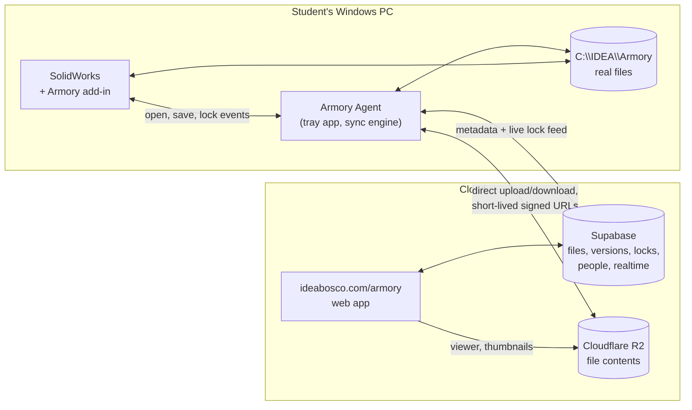

# IDEA Armory

Working name for the IDEA file vault: team CAD and project files, synced, locked and
versioned, for FRC Team 5669 and for IDEA class team projects. This document owns the
product scope. It separates what Mr. Pina said from what this scope proposes, and every
open choice is in "Decisions owed" at the end with the default that will be taken.

Scoped 2026-09-27 from the IDEA & FRC chat. Nothing is built.

## What Mr. Pina asked for, in his words

Stated 2026-09-27:

- Something "along the lines of" CacheCAD, "a file management interface for Google Drive
  that allows selective syncing of files", for designing things, for the FRC team, and
  for IDEA team projects.
- CacheCAD "works", but is "quite buggy", "the interface could be a lot better and the
  user experience can be a lot better, especially for high schoolers", who "have never
  used anything like this before and aren't familiar with how Google Drive works". For
  the team, "it's not practical enough to be useful. It was useful last season, but our
  file management was such a mess still."
- "A fully custom from the ground up IDEA application", named "something creative with
  idea in it" (IdeaCAD is taken).
- On the web, downloadable, or both: "whatever the best combination of things is, I want
  it." SolidWorks needs files on the desktop.
- "No compromises, absolutely none." "Very much functional, very much form. A beautiful
  application, but also an extremely functional and useful application."
- SolidWorks PDM is not available: the team has the Student Sponsorship package, and the
  app must also serve IDEA class projects on IDEA computers that "don't have access to
  the same things".

## What the research found

**CacheCAD** (cachecad.com, built with FRC 8096). A Windows desktop app that diffs a local
folder against a Google Drive folder and shows two checklists, Upload Changes and
Download Changes. A file whose newer side it cannot determine is marked Mismatch and left
unchecked. There is no locking, so nothing stops two students editing one part. History
is Google Drive's revision history, 30 days by default. The author's own guide says
projects load slowly "because of the way the Google API interface works". Early bugs
reported on its launch thread: a `/` or an emoji in a Drive folder name crashed the
client. Stable release 1.1.1 is dated 2024-01-05; a 1.2.0 beta is dated 2025-09-24.

**The failure every tool shares is the human step.** Team wikis that run CacheCAD tell
students "ALWAYS DOWNLOAD YOUR CHANGES BEFORE WORKING", and warn that work is deleted when
they do not. On the 3DEXPERIENCE thread one mentor joked about a daily 4:50 PM "CHECK IN YOUR FILES"
reminder; another said their team kept a sign on the door under GrabCAD, and under
CacheCAD he walked to every computer and synced it himself because nobody remembered.
PDM, GrabCAD, CacheCAD and 3DEXPERIENCE all depend on a student remembering to press a
button. **Armory's central rule is that no correctness depends on anyone remembering
anything.**

**The landscape.**

| Option | Status for us |
|---|---|
| GrabCAD Workbench | Discontinued June 1, 2023. It is what every FRC SolidWorks team is still trying to replace |
| SOLIDWORKS PDM | The 2026 education matrix shows PDM Standard in the Education Edition only, and no PDM in Student Sponsorship. It needs a self-managed server. One team nearly set it up and stopped because upkeep would fall apart once the one student who understood it graduated |
| 3DEXPERIENCE (in the sponsorship) | Works with desktop SolidWorks through an add-in; called clunky by the teams that tried it |
| Onshape | Solves sharing by being a different CAD program. Not an option while SolidWorks is what IDEA teaches |
| Git with Git LFS | Real locks (`git lfs lock`), and LFS makes a file locked by someone else read-only, which SolidWorks respects. Costs: every checkout downloads whole files, no reference awareness, and Git itself is the wrong mental model for a freshman |
| FrameCAD (FRC 2129) | The closest prior art: check-out and check-in locks, a SolidWorks task pane add-in, auto part numbering, where-used, release states. Its repository description still says Git LFS; its current README runs on a Google Shared Drive plus a self-hosted lock server. One team's project, zero stars. Its feature list is a checklist of what teams want; its manual Publish and Sync buttons keep the human step |

**SolidWorks mechanics that decide the design.**

- SolidWorks resolves a referenced file by searching memory first, then the folders
  listed in File Locations, then folders around the parent document and the path saved
  in it.
  **A same-named file already open wins**, which is why two different parts both called
  `Plate.SLDPRT` break an assembly. File names must be unique across the whole vault.
- Renaming a file outside SolidWorks breaks every assembly and drawing that references
  it. Renames and moves must go through a tool that updates the parents.
- The SOLIDWORKS Document Manager API reads and rewrites references without SolidWorks
  running, but its key is issued only to customers under subscription, and a key reads
  only files from its own version or older. Whether our sponsorship qualifies is unknown
  until a key is requested (decision 5). Without one, reference work happens inside the
  add-in while SolidWorks is open, through the full SolidWorks API, which needs no key.
- Every machine should see the vault at the **same absolute path**, so a path saved in a
  parent on one computer is correct on every other.

**Google Drive as the store.** Drive can lock a file (`contentRestrictions.readOnly`), but
any user with edit access can remove the lock, so it is advisory. Its API latency is the
slowness CacheCAD's own author describes. And the students this is for do not understand
Drive's sharing model, which is Mr. Pina's complaint.

## The answer: three pieces, one system

Both the website and a download, because each does something the other cannot. A browser
cannot keep files at a fixed disk path in the background, and SolidWorks needs real files
there. A desktop app alone cannot be opened from a phone, a Chromebook, or a Mac.

1. **Armory on ideabosco.com.** Browse every project, see who is editing what right now,
   every version of every file with who saved it and when, a 3D view and thumbnails, the
   release state of every part, the manufacturing queue, and team and class admin. Works
   on any device. Signs in with the site's existing Google sign-in.
2. **Armory Agent, a Windows tray app** downloaded from the site. Owns the vault folder at
   `C:\IDEA\Armory`, keeps it current in the background, uploads saves, holds and
   releases locks, and queues everything while offline. Built on .NET with a WebView2
   window whose screens are the same Svelte components as the website, so the two look
   and behave as one product. Windows only, because SolidWorks is; Mac and Chromebook
   users use the website.
3. **The Armory add-in inside SolidWorks.** A task pane plus banners: takes the lock when
   you start editing, uploads when you save, tells you when a newer version is waiting,
   creates new parts with their part number already assigned, and does renames, moves and
   copies with every reference updated.

**Storage.** File contents go to Cloudflare R2, stored by content hash so an unchanged
file is never stored twice. R2 charges nothing for downloads, which is the whole cost of a
sync tool, and $0.015 per GB-month above a free 10 GB (100 GB is about $1.35 a month).
Everything else (files, versions, locks, people, projects) lives in the idea-app Supabase,
whose realtime feed is what makes a lock appear on every screen at once. The website never
proxies file bytes: it hands out short-lived signed URLs and the agent talks to R2
directly. A nightly readable mirror to a Google Shared Drive is the escape hatch, so the
data never depends on Armory existing (decision 2).

## How it behaves: the product rules

These are the rules the build is measured against. Each one removes a step CacheCAD
leaves to a person.

1. **There is no upload button.** Saving in SolidWorks is the upload. The agent sends the
   new version in the background, and the file shows as saved on every screen within
   seconds.
2. **There is no download button.** The agent pulls every newer version as it lands. A
   file you have open is never overwritten under you; SolidWorks shows "A newer version
   from Maria is ready" and reloads when you say so.
3. **Locks take themselves.** The first edit to a file takes its lock, silently. Anyone
   else who opens it gets it read-only with a banner naming who has it and a Request
   button that notifies them. Closing the file, saved, releases the lock.
4. **A lock is visible everywhere, live**, on the website, in the agent and in the
   add-in: who, since when, and whether their changes have reached the server.
5. **Nothing is ever overwritten or lost.** Every version is kept, with no 30-day window.
   A lock broken by a mentor, or an offline edit that collides with a newer one, is saved
   as a side version with the student's name on it, never discarded; a lead picks which
   one continues.
6. **Offline works.** At a competition with no internet, students keep working on real
   files. The agent queues every save and lock and reconciles when it reconnects.
7. **Names are unique and permanent.** A new part gets its part number at creation from
   the team's scheme (decision 4), so a rename is never needed to "make it official". The
   vault refuses a duplicate name.
8. **Renames, moves and copies go through Armory**, and every parent assembly and drawing
   is updated. A Save As that would fork a part is caught and offered as a proper copy.
9. **The same path everywhere.** `C:\IDEA\Armory\<project>` on every computer, so saved
   reference paths are right on every machine.
10. **Get what you need, not everything.** Selective sync by project and subsystem, and
    "get this assembly" pulls the assembly and everything it references, whatever folder
    it is in.
11. **The COTS library is separate and read-only**: vendor parts shared across every
    project, updated by leads, never edited in place by a student.
12. **Any file syncs.** SolidWorks gets the extra intelligence, but a Fusion file, an STL,
    an IdeaCAD export, a photo or a spreadsheet is versioned and locked the same way, so
    IDEA classes without the FRC setup use the same vault.
13. **No training.** A student who has never used a vault is syncing, editing and saving
    correctly in their first session, untold. This is the acceptance test, in the same
    sense as IdeaCAD's.
14. **Nobody is locked out by their SolidWorks release.** Every file in the vault opens
    and edits in the oldest release the team uses. See "Two SolidWorks versions at once".

## Two SolidWorks versions at once

Stated by Mr. Pina 2026-09-27: FRC members' own computers run SolidWorks 2026 and the IDEA
desktop PCs run SolidWorks 2025. Most work happens in class on the 2025 machines, and "no
one is being left out": a 2025 user must be able to open and edit anything a 2026 user
saved. Buying 2026 for the IDEA PCs only moves the same problem to next year, so the
system has to handle mixed versions permanently.

**What SolidWorks itself does.**

- A file saved in a newer release does not open for editing in an older one. The last
  service pack of a release (SP5) opens parts and assemblies from the next release
  read-only, as a single "Future version file" with no feature tree: usable in an
  assembly and for measuring, not editable. It does not open drawings from the next
  release at all.
- Since SOLIDWORKS 2024, **Save as Previous Version** writes a part, assembly or drawing
  back up to two releases, with its feature tree, so it stays editable in the older
  release. It is lossy. A feature that did not exist in the older release blocks the save
  until it is removed, and the save silently drops annotations, appearances, decals,
  scenes and lights, custom properties, explode steps, simulation studies and add-in
  data. One reseller wrote in 2024 that it requires an active subscription license;
  whether our Student Sponsorship and the IDEA PCs' license count is unknown until tried.

**Armory's rule: no file in the vault is ever newer than the oldest SolidWorks the team
uses.** The vault carries a pinned version (2025 now), and every path into it keeps that
true:

1. **On a 2026 computer, a save is written back to 2025 automatically.** The add-in runs
   Save as Previous Version on every save of a vault file, so what reaches the vault
   opens and edits in 2025. The student does nothing different.
2. **Nothing it drops is lost, because Armory keeps it.** Custom properties (part number,
   description, material, vendor) live in Armory's database, and the add-in writes them
   back into the file on every open and save, in either version. Appearances and
   annotations are what a 2025 save loses; that is a cost of mixed versions, stated once
   in the add-in, not a hidden one.
3. **A save that cannot go back is stopped before it happens**, never uploaded. If a
   2026 student uses a 2026-only feature, the add-in names the feature when it is added
   and again at save, and offers two ways out: rebuild it with a 2025 feature, or keep it
   as that student's private draft until the team moves to 2026. The shared file stays
   editable by everyone.
4. **A 2026-format file can never slip in.** The agent checks the saved release of every
   SolidWorks file it uploads and refuses one newer than the vault's, whether it came
   from SolidWorks with the add-in off, a Save As outside the vault, or a download.
5. **Viewing never depends on the version.** The website's viewer and thumbnails show
   every file to everyone, on any device, whatever release saved it.
6. **One add-in for every release, not two.** Built against the oldest SolidWorks API the
   team runs and tested on both releases before every add-in release. Where a call exists only in the newer release (Save as Previous Version is
   one), the add-in checks the running release and uses it only there.
7. **The season rollover raises the vault's version in one move.** Each summer, once
   every machine the team uses has the new release, a lead raises the pinned version and
   files upgrade as they are next saved. Save as Previous Version reaches two releases
   back, so the IDEA PCs can trail personal computers by up to two releases before
   anything breaks; Armory shows that gap and warns a season ahead.

**If back-saving turns out not to be available under our licenses**, the rule still holds
by the other route: personal computers install the vault's release (2025 now) alongside
or instead of 2026, and the add-in on a 2026 install opens vault files read-only with a
banner saying so. That is decided by the phase 0 spike, not guessed.

## Beyond sync: what makes it the team's system

- **Release states** per part: Draft, In Review, Released, Made. A Released part is
  locked against edits until a lead reopens it. The manufacturing queue lists Released
  parts by process and material, for the shop to work through.
- **Where used and BOM.** Every assembly a part is in; a live bill of materials per
  assembly and for the whole robot, with mass rollups from each part's mass properties.
- **History you can read.** Every version with its thumbnail, its author and a note, a
  timeline per file and per project, and one-click restore of any version as the new
  latest.
- **IDEA Classroom tie-in.** A class team project is an Armory project. The instructor
  sees each student's own saves on the team's files, which is contribution evidence for
  grading a team project without asking who did what. An assignment links to its project.
- **Roles.** Student, CAD lead, mentor, instructor. Leads and mentors break locks,
  release parts and manage the COTS library.

## Design

A product identity of its own, like GAUNTLET, VANGUARD and GREENLINE, built to
`IDEA_INTERFACE_STANDARDS.md` on both the website and the agent. The screens a student
lives in are three: my files (what I have locked and what is unsaved), the project tree
(with live lock and status marks on every row), and a file's history. Everything else is
for leads. Scoped through the Claude Design protocol before any screen is built.

## Phases

The date that matters: **Q3 starts January 5, 2027, and every IDEA class does FRC from
then** (`IDEA_context.md` 2.1). Armory has to be proven by then, with the team trained by
using it rather than by being taught it.

0. **Spike, before any product code.** Measure on one real IDEA computer and last season's
   robot CAD: upload and download throughput from the school network to R2, SolidWorks
   add-in open, save and close events, reading references through the add-in, whether a
   Document Manager key is granted, and the installed size of the agent. **Versions:**
   whether Save as Previous Version works under the Student Sponsorship license and the
   IDEA PCs' license, and through the API; whether the IDEA PCs' 2025 is on SP5; whether
   the sponsorship license installs 2025; how the agent reads a file's saved release
   without SolidWorks running; and a round trip of a real robot subassembly from 2026 to
   2025 and back, listing exactly what changed. Each result written down with its date
   and what measured it.
1. **Vault and agent.** Server model, R2 storage, sync engine, locks, offline queue, the
   agent's tray window, and the website's project browser with live locks and history.
   Usable by the team for real work without the add-in.
2. **The add-in.** Auto-lock, save-is-upload, newer-version banners, part numbering at
   creation, safe rename, move and copy, dependency-aware get.
3. **The team system.** Release states, manufacturing queue, where used, BOM and mass,
   3D view on the website, COTS library.
4. **Classes.** IDEA Classroom tie-in and per-student contribution views.

## Where the code lives

- `pina-hash/idea-armory` (private): the Windows agent, the add-in and the sync core,
  in .NET. Lane C1, issued 2026-09-27 to GPT-6 Astra in Codex, builds `Armory.Core`, the
  pure rules library, and a deterministic simulation that proves no saved work is lost.
  It depends on no open decision and no spike result; its defaults (name, part number
  pattern, lock authority) are all configurable.
- `pina-hash/idea-app`: the website at `/armory`, the Supabase schema and the RPCs, in a
  later lane.

## Where it runs now

Added 2026-10-06 by lane B (`docs/prompt-ledger/entries/armory-b-website.md`), built to
`docs/agent/CONTRACT.md` in pina-hash/idea-armory at `b18791d`. Armory is **unlisted**:
nothing on the home page or in the site's shared navigation points here until the pilot.

**Routes** (signed-in pages render a sign-in panel rather than redirecting, so a connect
link survives a sign-in):

| Route | What it is |
|---|---|
| `/armory` | My projects; a site admin also gets Create project |
| `/armory/<project>` | The folder tree with a live mark on every file, and the people (mentors and CAD leads add and remove) |
| `/armory/<project>/file/<file>` | Every version and side version, with who saved it and when, and who holds it now |
| `/armory/connect` | Contract 3b: "Connect <device> to Armory as <email>?" |
| `/armory/download`, `/armory/download/<file>` | The Windows app, streamed from the private release |
| `POST /api/armory/blob-url` | Contract section 2 (the agent's Bearer token) |
| `POST /api/armory/connect/start`, `POST /api/armory/connect/exchange` | Contract section 3 |
| `/dev/armory` | The dev harness (404 in production) |

**What Mr. Pina sets in Vercel** (Production and Preview, server-only, never `PUBLIC_`):

- `ARMORY_R2_ACCOUNT_ID`, `ARMORY_R2_ACCESS_KEY_ID`, `ARMORY_R2_SECRET_ACCESS_KEY`,
  `ARMORY_R2_BUCKET`. Until all four are set, `blob-url` answers 503
  `armory_storage_not_configured` and the project page says file storage is not switched
  on. The R2 token needs Object Read and Write on that one bucket only.
- `ARMORY_RELEASES_TOKEN`: a fine-grained GitHub token with **Contents: read** on
  pina-hash/idea-armory only. Unset, `/armory/download` says "Ask Mr. Pina for the Armory
  flash drive" and shows no link.
- `SUPABASE_SERVICE_ROLE_KEY` is already set; Armory uses it for the connect codes and to
  mint the agent's own session.

**Supabase auth redirect allowlist: nothing to add.** The agent's session is minted
server-side (contract 3e): `auth.admin.generateLink` is called without `redirectTo`, only
its `hashed_token` is used, and `verifyOtp` exchanges that hash directly, so no email is
sent and no redirect URL is ever followed. The loopback `http://127.0.0.1:<port>/callback`
is a redirect THIS site issues after its own POST; Supabase never sees it.

**The schema is proposed, not live:** `docs/armory/proposed/NNNN_armory.sql`. It must not
be moved into `supabase/migrations/` until the router chat numbers it and Mr. Pina
approves it (`docs/decisions/entries/46-armory-migration-number-and-approval.md`),
because `migrate.yml` applies that directory to production on every push to `main`.
Until it is applied, every Armory page says "Armory is not switched on yet" and the API
answers 503.

## Decisions owed

Each has the default that will be taken if he does not choose otherwise.

1. **Name.** Default **IDEA Armory**: in an armory, every piece of equipment is checked out
   to one person and checked back in, and it sits beside GAUNTLET and VANGUARD. Other
   candidates: IdeaVault, IDEA Hangar.
2. **Where file contents live.** Default **Cloudflare R2 plus the existing Supabase, with a
   nightly mirror to a Google Shared Drive.** The alternative, Drive as the primary store,
   inherits CacheCAD's speed, advisory locks and the sharing model students do not
   understand.
3. **Who can break a lock and release a part.** Default: mentors and the CAD lead.
4. **Part number scheme.** Default: `5669-YY-SSNN`, team, season, two-digit subsystem, two-
   digit part, in the style of 254's system; class projects get a course prefix.
5. **Request a Document Manager API key** through the SolidWorks key request form under
   the team's account. It is his, because it is his account; the scope works without it.
6. **Can the agent be installed on IDEA computers**, and are they reimaged? His to ask of
   school IT. The design treats the local copy as disposable either way.
7. **Mixed SolidWorks versions.** Default: **back-save automatically** as described in "Two
   SolidWorks versions at once", with personal computers installing the vault's release
   as the fallback if the spike shows back-saving is not licensed. Either way the vault
   stays at the oldest release in use, 2025 for this season.

## Sources

- [CacheCAD home](https://www.cachecad.com/home), [download page](https://www.cachecad.com/download), and its user guide (Google Doc linked from the site)
- [Introducing CacheCAD, Chief Delphi, 2023-09-22](https://www.chiefdelphi.com/t/introducing-cachecad/441337)
- [YETI Robotics wiki, Getting Started With CacheCAD](https://wiki.yetirobotics.org/books/cad/page/getting-started-with-cachecad)
- [GrabCAD is Shutting Down their Workbench, Chief Delphi](https://www.chiefdelphi.com/t/grabcad-is-shutting-down-their-workbench/414018)
- [Is 3DExperience Platform a Great Replacement for GrabCAD?, Chief Delphi, 2025](https://www.chiefdelphi.com/t/is-3dexperience-platform-a-great-replacement-for-grabcad/482923)
- [FrameCAD, FRC 2129](https://github.com/netarcx/FrameCAD)
- [CAD version control compared, CadShift, 2026](https://cadshift.com/blog/cad-file-version-control-best-practices/)
- [SOLIDWORKS Search Routine Order, Hawk Ridge Systems](https://support.hawkridgesys.com/hc/en-us/articles/115002871051-SOLIDWORKS-Search-Routine-Order)
- [SOLIDWORKS Document Manager API, Getting Started, 2024](https://help.solidworks.com/2024/english/api/swdocmgrapi/GettingStarted-swdocmgrapi.html)
- [Google Drive API, Protect file content](https://developers.google.com/workspace/drive/api/guides/content-restrictions)
- [Cloudflare R2 pricing summary, 2026](https://egresscost.com/cloudflare/)
- [Team 254, Part Numbering and Nomenclature](https://www.team254.com/documents/partnumbers/)
- [Exporting files for use in older SOLIDWORKS releases, Javelin, 2025](https://www.javelin-tech.com/blog/2025/03/exporting-files-for-use-in-older-solidworks-releases/)
- [Save As Previous Versions, incompatible items and errors, Javelin, 2024](https://www.javelin-tech.com/blog/2024/11/solidworks-save-as-previous-versions-incompatible-items-errors/)
- [How to open future version files in SOLIDWORKS, GoEngineer, 2024](https://www.goengineer.com/blog/open-future-version-files-in-solidworks)
- `EDU_SW_Desktop_ProductMatrix_2026_v3.pdf`, attached by Mr. Pina 2026-09-27
